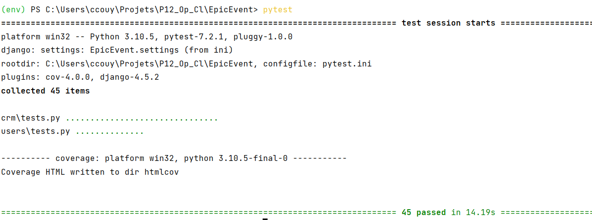
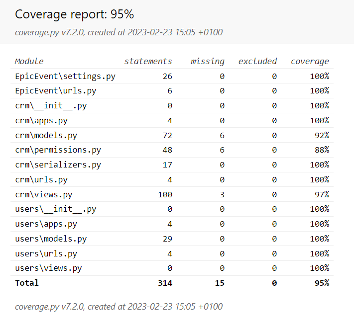
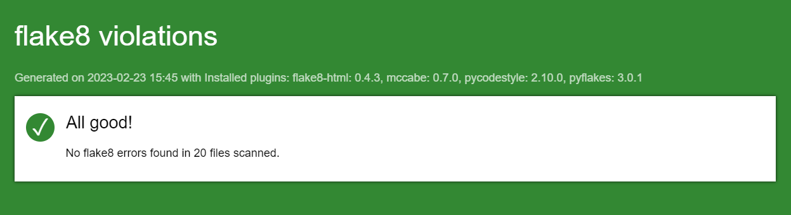

 

    

<h1 align="center">Projet 12 DA-Python OC</h1>

***EpicEvent : API de Gestion et conseil et de gestion***

Elaborée pour l'entreprise EpicEvents. Elle permet aux utilisateurs de travailler sur une base de données clients avec leurs contrats et événements.  
Il existe trois équipes (MANAGER, SALES et SUPPORT) qui déterminent les droits d'accès des utilisateurs.  
La base de données est gérée avec Django ORM et PostgreSQL.    
 

## Sommaire

**[1. Configuration et lancement](#heading--1)**
  * [1.1. Récupération locale de l'API](#heading--1-1)
  * [1.2. Installation de la base de données](#heading--1-2)
  * [1.3. Démarrage](#heading--1-3)

**[2. Tests](#heading--2)**
  * [2.1 Lancement des tests](#heading--2-1)
  * [2.2 Présentation des rapports](#heading--2-2)
       

### 1. Configuration et lancement

##### 1.1 Récupération locale de l'API :
   Depuis votre terminal, naviguez vers le dossier racine souhaité.

##### Récupération du projet
   Tapez :    

       git clone https://github.com/Cyl94700/P12_Op_Cl.git

##### Accès au dossier du projet, création et activation l'environnement virtuel
   Tapez :

       cd P12_Op_Cl
       python -m venv env (pour Windows)  
       python3 -m venv env (pour Mac)
       env\scripts\activate (pour Windows)  
       source env/bin/activate (pour Mac)
    
##### Installation des paquets requis
   Tapez :

       pip install -r requirements.txt

---------

####  1.2 Installation de la base de données  
##### Installation de PostgreSQL  
Installez PostgreSQL 15 via par exemple : https://www.postgresql.org/

Créez une base de donnée nommée '`epic_db`'.

Dans le settings.py du projet, au niveau du "DATABASES", vous pouvez modifier le paramétrage d'administarion de la base de données.

Possibilité de restaurer la base de données d'échantillon avec la commande psql dump.  
Tapez :    

       psql -U <db_admin_name> -d epic_db < base/<epic_db_echantillon.sql>

_<db_admin_name>_ : étant le nom d'administrateur de base de données ("postgres" dans notre cas)

###  1.3 Démarrage

##### Migration  

---
Se mettre dans le répertoire racine.

Faire les migrations pour l'initialisation de la base de données :  

 Tapez :    

       python manage.py makemigrations

puis:

       python manage.py migrate

##### Superuser  

Créez un superuser pour pouvoir accéder à la console d'administration :

    python manage.py createsuperuser

##### Lancement du serveur et utilisation  
Après avoir démarré votre base de données, tapez : 

       python manage.py runserver

Depuis l'adresse http http://127.0.0.1:8000/admin , vous pouvez accéder à la console d'administraion en tant que superuser.
Vous avez la possibilité de créer des utilisateurs des groupes de vente et de support, mais également des droits sur tous les objets de la base.

Vous pouvez consulter la documentation de l'API pour une utilisation des points de terminaison depuis Postman en tant qu'utilisateur d'un des trois groupes  
depuis dette adresse https://documenter.getpostman.com/view/22081221/2s93CGQvXJ

### 2. Tests

#### 2.1 Lancement des tests

###### Tests unitaires et de couverture  
 
Le fichier pytest.ini est configuré pour exécuter coverage en même temps que pytest.
Depuis le répertoire racine, exécutez simplement la commande :

    pytest  
- Le terminal vous indique alors le résultat des tests unitaires.   
- Un répertoire htmlcov est égélement présent. En l'ouvrant, vous pouvez consulter le rapport des tests de couverture à partir du fichier index.html

###### Flake8
Pour vérifier la cohérence du code avec la norme PEP8, vous pouvez lancer flake8-html et générer un rapport html.
Depuis le terminal, placez-vous à la racine du projet et tapez :
 

      flake8 --format=html --htmldir=flake8_report

Le dossier flake8_report contient le rapport global dans un fichier nommé index.html

#### 2.2 Présentation des rapports

###### Tests  
 

  

###### Flake8  

 
